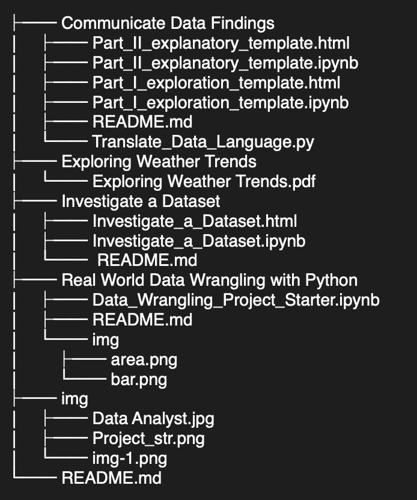

# Udacity-Data-Analyst-Nanodegree

# Created by Osama Alsubaie

This repository contains projects and practice set for Udacity Data Analyst Nanodegree.

# Repository Structure

# Project 1 : Investigate a Medical Appointment No Show Dataset

> In this project, I will be analyzing data associated with medical appointments in Brazil. The dataset contains information about 100k medical appointments in Brazil and is focused on the question of whether or not patients show up for their appointment. A number of characteristics about the patient are included in each row.
> The dataset
>
> - 110.527 medical appointments
> - 14 associated variables (characteristics)
> - The most important one if the patient show-up or no-show to the appointment
> - What factors are important for us to know in order to predict if a patient will show up for their scheduled appointment?
> - The analysis will be done using Python libraries NumPy, pandas, and Matplotlib.
> - The dataset can be downloaded from [Kaggle](https://www.kaggle.com/joniarroba/noshowappointments).

### Project Submission

[Check My Project Submission](https://github.com/alsubaie-os/Udacity-Data-Analysis-Nanodegree/tree/master/Investigate%20a%20Dataset)

# Project 2 : Real World Data Wrangling with Python

> In this project, I will be wrangling and analyzing a dataset of all real estate sales with a sales price of $2,000 or greater that occur between October 1 and September 30 of each year.
Each record in the dataset includes information such as town, property address, sale date, property type (residential, apartment, commercial, industrial, vacant land), sales price, and property assessment.

### Project Submission

[Check My Project Submission](https://github.com/alsubaie-os/Udacity-Data-Analysis-Nanodegree/tree/master/Real%20World%20Data%20Wrangling%20with%20Python)

# Project 3 : Communicate Data Findings

> In this project, I will be wrangling and analyzing a dataset which includes the total number of employees in Saudi Arabia (Saudi (male) - Saudi (female) - non Saudi (male) - non Saudi (Female)) according to the size of the enterprises (micros, small, medium, and large) and economic activity(using the National Classification of Economic Activities (ISIC4) - the second level) in each geographical region for 2022.

### Project Submission

[Check My Project Submission](https://github.com/alsubaie-os/Udacity-Data-Analysis-Nanodegree/tree/master/Communicate%20Data%20Findings)

# My Certificate of Completion

