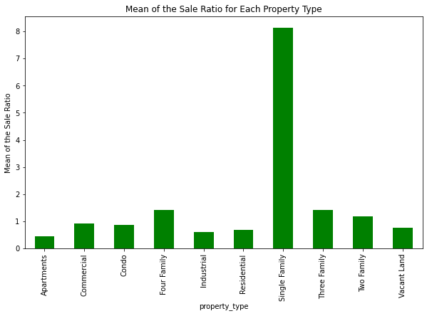

# Real World Data Wrangling with Python

## Table of Contents

<ul>
<li><a href="#intro">Introduction</a></li>
<li><a href="#gathring">Gather Data</a>
    <ul>
        <li><a href="#gathring_1">Gather Data Using CSV File</a></li>
        <li><a href="#gathring_2">Gather Data Using an API</a></li>
    </ul>
<li><a href="#data_Assessing_cleaning">Assess/Cleaning the Data</a></li>
<li><a href="#data_updating">Update the Data</a></li>
<li><a href="#research_question">Answer the Research Question</a></li>
<li><a href="#conclusion">Conclusion</a></li>
</ul>

## Introduction
In this project, I will be wrangling and analyzing a dataset of all real estate sales with a sales price of $2,000 or greater that occur between October 1 and September 30 of each year. 
Each record in the dataset includes information such as town, property address, sale date, property type (residential, apartment, commercial, industrial, vacant land), sales price, and property assessment.

#### The research question that I will be answering is:
>What is the property type that has the highest sale ratio (highest profitable property type)?

## Gather Data

### Gather Data Using CSV File
The first dataset is a CSV file that contains all real estate sales with a sales price of $2,000 or greater that occur between October 1 and September 30 of each year.

The CSV file is available at the following URL: [CSV Link](https://catalog.data.gov/dataset/real-estate-sales-2001-2018)

### Gather Data Using an API
The second dataset is an API that contains all real estate sales with a sales price of $2,000 or greater that occur between October 1 and September 30 of each year.

The API is available at the following URL: [API Link](https://data.ct.gov/Housing-and-Development/Real-Estate-Sales-2001-2020-GL/5mzw-sjtu)

## Assess/Cleaning the Data

### In this section, I combine the assessing and cleaning phases for each dataset.
The following order has been followed for each issue:
- identify the issue
    - assess the issue visually and programmatically
        - clean the issue
            - validate and update the cleaning

    

## Update the Data
In this section, I combined the two datasets into one dataset and make sure that the data is clean and ready for analysis.

## Answer the Research Question
In this section, I answer the following research question:
>What is the property type that has the highest sale ratio (highest profitable property type)?

### As we can see from the following figure, the property type that has the highest sale ratio is the **Single Family** with an average sale ratio of 8.145756.

## Conclusion
This project was a great opportunity to practice my data wrangling skills. I have learned a lot of new things and I have improved my skills in data wrangling. 
I have learned how to gather data from different sources, how to assess and clean the data, and how to combine different datasets into one dataset. 
I have also worked with a different libraries in this project includes `Pandas, NumPy, Seaborn, Matplotlib, and Request`.

